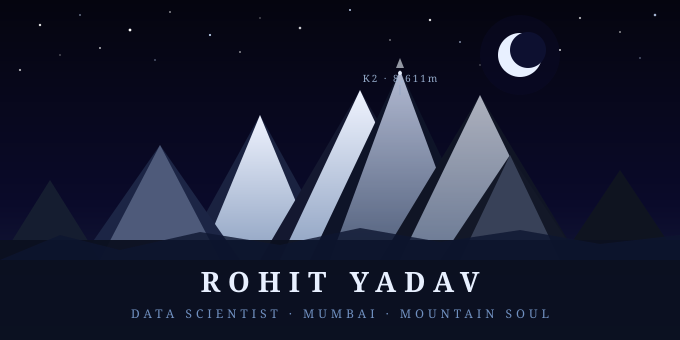

<div align="center">

<!-- MOUNTAIN BANNER — save the SVG below as banner.svg and upload to your repo -->


</div>

---

<div align="center">

[](https://git.io/typing-svg)

</div>

---

## 🧭 The Climber

```
  Name        →  Rohit Yadav
  Origin      →  Mumbai, Maharashtra, India 🇮🇳
  Craft       →  Data Science · Finance · Machine Learning
  Peaks       →  Tungnath · Kedarkantha · Sahyadri · K2 (the dream) 🏔️
  Hours       →  Night shifts. Always. Sleep is negotiable.
  Soundtrack  →  90s Bollywood · Ghazals · Wind above the treeline 🎧
  Literature  →  Hindi poetry · the language of rivers and rain 📖
  Chai count  →  uncountable ☕
  Dream       →  Remote work from a village above the clouds 🌍
```

---

## 🏔️ The Trek Log — A Data Science Journey

> *Every mountain is climbed one step at a time.*
> *Every model is built one commit at a time.*
> *Here is the ascent — from valley floor to death zone.*

---

```
┌─────────────────────────────────────────────────────────────────┐
│  BASECAMP  ·  The Valley  ·  ~2,000m                           │
│─────────────────────────────────────────────────────────────────│
│                                                                 │
│  Where all climbers begin. The tools are heavy.                 │
│  The path is unclear. But the mountain is calling.              │
│                                                                 │
│  ⛺  Linear Regression — Ecommerce dataset (Kaggle)            │
│      Learning pandas, numpy — the ropes and crampons           │
│      "So this is what data looks like."                         │
│                                                                 │
└─────────────────────────────────────────────────────────────────┘
```

```
┌─────────────────────────────────────────────────────────────────┐
│  CAMP I  ·  The Treeline  ·  ~3,500m                           │
│─────────────────────────────────────────────────────────────────│
│                                                                 │
│  The trees thin. The air changes.                               │
│  You realise this is harder than you thought.                   │
│  You continue anyway.                                           │
│                                                                 │
│  🏕️  Loan Approval Predictor                                    │
│  🏕️  Credit Card Fraud Detector        ← 99.92% accuracy       │
│  🏕️  Stock Price Trend Classifier      ← SMA · EMA · RSI · MACD│
│  🏕️  Customer Churn Prediction         ← SMOTE · Random Forest  │
│  🏕️  Credit Risk Scoring System        ← German Credit dataset  │
│                                                                 │
│      "Numbers can catch criminals. I had no idea."              │
│                                                                 │
└─────────────────────────────────────────────────────────────────┘
```

```
┌─────────────────────────────────────────────────────────────────┐
│  CAMP II  ·  Above the Clouds  ·  ~5,000m                      │
│─────────────────────────────────────────────────────────────────│
│                                                                 │
│  You look down and see how far you've come.                     │
│  You look up and see how far there is to go.                    │
│  This is where most people turn back.                           │
│                                                                 │
│  🔭  Customer Segmentation         ← K-Means clustering         │
│  🔭  Automated Credit Risk         ← PCA + KMeans + Streamlit   │
│  🔭  Insurance Claim Predictor     ← Streamlit deployed          │
│  🔭  Stock Market Sentiment        ← Financial NLP headlines     │
│  🔭  Global Inflation Visualiser   ← Economic EDA               │
│  🔭  ETL Pipeline for Finance      ← Data engineering           │
│  🔭  A/B Testing App Features      ← Statistical thinking       │
│  🔭  Bank Branch Dashboard         ← Analytics                  │
│  🔭  BNPL Risk Model               ← Credit default prediction  │
│  🔭  Bitcoin Sentiment via Twitter ← Crypto + NLP               │
│  🔭  ESG Score Predictor           ← Company sustainability ML   │
│                                                                 │
└─────────────────────────────────────────────────────────────────┘
```

```
┌─────────────────────────────────────────────────────────────────┐
│  CAMP III  ·  The Death Zone Begins  ·  ~7,000m                │
│─────────────────────────────────────────────────────────────────│
│                                                                 │
│  Here the oxygen thins.                                         │
│  The problems grow harder. The models grow deeper.              │
│  Language itself becomes a dataset.                             │
│                                                                 │
│  ⚡  SIP ROI Simulator             ← Personal finance ML        │
│  ⚡  NPA Risk Analysis             ← Non-performing assets      │
│  ⚡  Credit Risk Default Predictor ← Banking ML                 │
│  ⚡  Amazon Review NLP Pipeline                                 │
│      ├─ 50,000 reviews · 89% sentiment accuracy                │
│      ├─ LDA topic modeling — 8 themes, zero labels             │
│      ├─ Word2Vec: dog + food − treat = purina 🤯               │
│      └─ spaCy NER — 16 brands extracted from raw text          │
│                                                                 │
└─────────────────────────────────────────────────────────────────┘
```

```
┌─────────────────────────────────────────────────────────────────┐
│  CAMP IV  ·  The Summit Push  ·  ~8,000m                       │
│─────────────────────────────────────────────────────────────────│
│                                                                 │
│  The wind is violent here. The cold is absolute.               │
│  PyTorch. TensorFlow. Transformers.                             │
│  K2 at 8,611m is in sight.                                      │
│  The ascent continues.                                          │
│                                                                 │
│  🌌  Deep Learning with PyTorch        [ IN PROGRESS 🔄 ]      │
│  🌌  TensorFlow Neural Networks        [ IN PROGRESS 🔄 ]      │
│  🌌  HuggingFace Transformers          [ LOADING      ⏳ ]      │
│  🌌  End-to-end ML deployment          [ QUEUED       📋 ]      │
│                                                                 │
│              ❄️  Summit not yet claimed.                        │
│                  But the boots are laced.                       │
│                                                                 │
└─────────────────────────────────────────────────────────────────┘
```

---

## 🧰 The Climber's Kit

```
  Essential gear — never leave basecamp without:
  ┌────────────────────────────────────────────────────┐
  │  🪢  Python          the rope — holds everything   │
  │  🗺️  Pandas · NumPy  map and compass               │
  │  ⛏️  scikit-learn    the ice axe                   │
  │  🔦  XGBoost · SMOTE headlamp in the dark          │
  │  📡  NLTK · spaCy    radio to read the signals     │
  │  🧪  Matplotlib      reads the weather ahead       │
  │  🏕️  Flask·Streamlit builds the camp               │
  │  🐳  Docker          carries the base on its back  │
  │  🧲  SQL · MySQL     finds water in the rock       │
  │  🌬️  PyTorch         learning the wind             │
  └────────────────────────────────────────────────────┘
```

---

## 📡 Expedition Records

<div align="center">


</div>

<div align="center">

[](https://git.io/streak-stats)

</div>

---

## 📜 From the Trail Diary

<div align="center">

```
  ┌──────────────────────────────────────────────────────────┐
  │                                                          │
  │  On Tungnath, above 3,680m, I understood something.     │
  │  The mountain does not reward the loudest climber.       │
  │  It rewards the one who keeps walking.                   │
  │                                                          │
  │  Data Science is the same.                              │
  │  Not the one with the most certificates.                │
  │  The one who keeps building — at midnight,              │
  │  in silence, one commit at a time.                      │
  │                                                          │
  │  Kedarkantha taught me patience.                        │
  │  The Sahyadri taught me to find beauty in fog.          │
  │  The data teaches me everything else.                   │
  │                                                          │
  │                        — Rohit, somewhere uphill        │
  └──────────────────────────────────────────────────────────┘
```

</div>

---

## 🌄 Find Me on the Trail

<div align="center">

[](https://twitter.com/ashwathama56)
[](https://www.linkedin.com/in/rohit-kumar-yadav-b97360194/)
[](https://www.kaggle.com/rohit2255)
[](https://www.hackerrank.com/profile/ry661432)
[](mailto:ry661432@gmail.com)

</div>

---

<div align="center">

*"The best models, like the best views, come after the hardest climbs."*


**पर्वत बुलाते हैं — and the data follows** 🏔️

</div>
